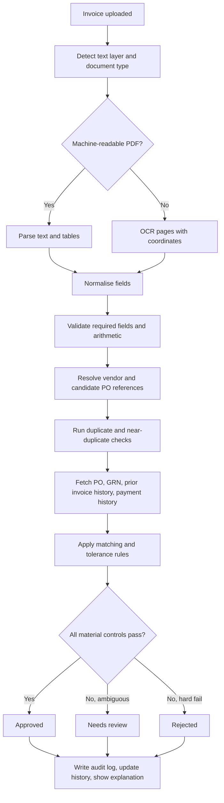
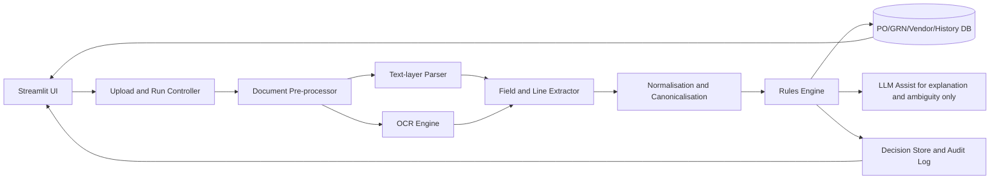

# Production-Ready Invoice Processing Automation for a Live Streamlit Demo

## Executive summary

Your case study is explicitly not asking for a flashy “AI demo”; it is asking for a **working operational process** that accepts a real invoice, runs live, makes a reasoned decision, shows intermediate stages, handles edge cases deliberately, and exposes history/status/output in a UI or dashboard. The assignment also makes clear that messy invoice inputs and non-trivial exceptions are central to the problem: clean text PDFs and scanned images both appear; line items may be itemised or bundled; tax may be embedded or separate; PO references may be explicit or implied; fields such as invoice number, date, or total may be missing; and procurement-side logic includes approved vendors, PO amounts, tolerance thresholds, duplicate detection, and split invoices against one PO. fileciteturn0file0

The strongest production pattern for this kind of demo is therefore a **hybrid pipeline**: deterministic document ingestion and matching rules first; OCR and layout-aware extraction only when needed; an LLM used narrowly for messy normalisation or reviewer explanations; and a **human-review lane** whenever core controls are uncertain. That design matches both the assignment’s requirement for explainability and the reality that invoice layouts vary widely, unseen templates are common, and photographed or partially degraded documents still break purely rigid extraction. Research on invoice/document automation consistently shows that unseen layouts, complex validation constraints, and messy image conditions are the hard parts, not the happy path. citeturn30academia0turn30academia2turn39academia1turn39academia2turn43academia9

For your specific Streamlit build, the right product decision is **not** to chase maximum touchless automation. The right decision is to optimise for three things: robust extraction on mixed inputs, conservative approval logic, and reviewer-friendly explanations. In practice, that means: first-pass text extraction for machine-readable PDFs; OCR fallback for scans; configurable two-way and three-way matching; exact and near-duplicate checks; cumulative PO consumption tracking for split invoices; explicit handling for credit notes and multi-PO invoices; and a run view that shows field extraction, validation results, matching evidence, confidence, and final disposition (`Approved`, `Needs review`, `Rejected`). fileciteturn0file0 citeturn30academia0turn30academia2turn33search0

The most credible live-demo architecture is a small, disciplined Python stack: **Streamlit + pandas + SQLite/Postgres + pdfplumber + OCR fallback + deterministic rules engine + optional LLM assist**. Use commercial systems as reference points for workflow design and controls, not as a target for full parity. Publicly visible materials show SAP Concur, Coupa, Tipalti and Basware as broad spend/AP/P2P platforms, while current open approaches cluster around OCR engines, layout-aware document parsing, and invoice-specific information extraction models. citeturn41search1turn41search0turn41search3turn41search2turn43search0turn39academia1turn39academia2turn43academia9

The single most important implementation principle is this: **auto-approve only when every material control passes deterministically**. If vendor identity, document uniqueness, arithmetic, PO linkage, tax logic, receipt status, or confidence is ambiguous, do not “probably approve”; route to review with an explanation. That is both the safest operational stance and the strongest interview/demo stance, because the system can explain exactly why it did not trust itself. fileciteturn0file0 citeturn30academia2turn5academia2turn33search0

## Scenario map

The scenario set for a realistic invoice-processing demo should be broad enough to prove judgement, but small enough to run flawlessly live. The prompt itself already gives you a strong scenario backbone: clean PDFs versus scans, explicit versus implied PO references, separated versus embedded tax, missing critical fields, amount tolerances, duplicate checks, and split invoices against a single PO. Research adds two more important realism layers: unseen document layouts and poor input quality such as photographed, degraded or partially handwritten documents. fileciteturn0file0 citeturn30academia0turn30academia2

### Recommended scenario catalogue

| Scenario family | Concrete case | Recommended system behaviour | Default disposition |
|---|---|---|---|
| Happy path | Machine-readable PDF, one vendor, one PO, all totals and tax reconcile, no duplicate, vendor is approved | Extract directly, validate arithmetic, match PO, check remaining amount/quantity, approve | Approved |
| Happy path | Scanned goods invoice, OCR succeeds, GRN exists, quantities received cover invoiced quantities | OCR, validate, perform three-way check, approve | Approved |
| Happy path | Split invoice against one PO, prior invoices exist but cumulative invoiced amount remains within PO balance | Add cumulative consumption check, approve with “partial PO consumption” note | Approved |
| Common exception | Missing invoice number but vendor/date/amount present | Disallow auto-approval; run near-duplicate checks using fuzzy composite key | Needs review |
| Common exception | PO reference implied, not explicit | Use vendor + amount + line-item similarity to propose candidate PO; never auto-approve on weak match | Needs review |
| Common exception | Invoice total slightly above PO or line variance within configured tolerance | Explain tolerance calculation and route based on threshold | Approved or Needs review |
| Common exception | Tax presented separately or embedded in lines | Recompute net/tax/gross and verify arithmetic | Approved or Needs review |
| Common exception | Bundled invoice lines do not map one-to-one to PO lines | Allow header-level match only if line-level mapping is impossible but totals and receipt logic are safe | Needs review |
| Common exception | Multi-page invoice with long line table | Preserve page/line provenance and aggregate line totals before matching | Approved or Needs review |
| Rare edge case | Exact duplicate invoice number for same vendor | Reject unless explicitly marked as credit/reissue and linked to prior invoice | Rejected |
| Rare edge case | Near-duplicate due to OCR or vendor typo | Flag probable duplicate with evidence from normalised vendor/date/amount key | Needs review |
| Rare edge case | Multi-PO invoice | Split into PO slices only if all referenced POs are open and belong to same vendor/legal entity | Needs review |
| Rare edge case | Credit note or negative adjustment | Link to original invoice/PO and treat as negative financial event, not as a normal payable | Needs review or Approved |
| Rare edge case | Currency mismatch between invoice and PO | Compare using stored PO currency policy and documented FX source/date; no silent conversion | Needs review |
| Rare edge case | Goods invoice without receipt/GRN | Block auto-approval for receipt-controlled goods | Needs review |
| Rare edge case | Photo of a crumpled or partially handwritten invoice | Low-confidence extraction should be surfaced, not hidden | Needs review |

The table above is a recommended operating model rather than a legal standard, but it is grounded in the exact complexity described in the assignment and in document-understanding literature that shows layout variation, OCR fragility, and multi-criteria validation are the core production challenges. fileciteturn0file0 citeturn30academia0turn30academia2turn39academia2

### The best live-demo scenario set

For the interview, do not try to demonstrate all of the above. Demonstrate four runs:

| Priority | Demo case | Why it is the right demo case |
|---|---|---|
| Must-have | Clean single-PO invoice auto-approved | Shows happy path speed and end-to-end determinism |
| Must-have | Exact duplicate rejection | Shows risk control, not just extraction |
| Must-have | Split invoice within remaining PO balance | Shows cumulative state/history, not stateless matching |
| Must-have | Scanned invoice with weak fields routed to human review | Shows graceful failure and explainability |

This fits the assignment’s advice to build the happy path first, then add a small number of non-trivial edge cases that prove judgement rather than breadth. fileciteturn0file0

## Commercial and open-source system landscape

Publicly accessible material on the major commercial platforms is useful for **direction**, but it is not detailed enough to replicate their internal matching engines feature-for-feature. What public sources do show clearly is the product shape: SAP Concur as a large spend-management SaaS platform, Coupa as a cloud total-spend platform with e-invoicing lineage, Tipalti as AP automation with PO matching and fraud controls, and Basware as a long-standing P2P/e-invoicing specialist with a large invoice network. That is enough to borrow product patterns, but not enough to justify copying hidden rule settings. citeturn41search1turn41search0turn41search3turn41search2

### Commercial systems comparison

| System | Publicly documented positioning | Useful design takeaway for your demo | Evidence |
|---|---|---|---|
| SAP Concur | Large spend-management SaaS platform with broad enterprise footprint | Emphasise clean workflow visibility and enterprise-friendly run history, rather than only field extraction | citeturn41search1 |
| Coupa | Cloud-based total spend management; acquired InvoiceSmash, an e-invoicing vendor | Treat invoice processing as part of a supplier/PO/workflow graph, not as isolated OCR only | citeturn41search0 |
| Tipalti | AP automation with PO matching integrated with NetSuite; fraud monitoring via Tipalti Detect | Duplicate/fraud controls deserve equal prominence to extraction accuracy | citeturn41search3 |
| Basware | Long-running P2P and e-invoicing platform; invoice-processing heritage and network scale | Build for repeatable touchless processing, but keep strong exception handling and archival history | citeturn41search2turn41news4 |

### Open-source and research systems comparison

| System family | Best role in your demo | Strengths | Limits | Evidence |
|---|---|---|---|---|
| Tesseract with positional output | OCR fallback for scans and photographed invoices | Mature, multilingual, can output layout-aware formats such as hOCR; good fit for CPU-only demos | Sensitive to image quality and pre-processing; weaker on complex layout understanding | citeturn43search0turn40search3 |
| PaddleOCR and PP-Structure | Default open-source OCR/layout stack if you want stronger structure parsing | Modern open-source OCR + document parsing + key-information extraction; deployment-oriented | Heavier than a minimal demo; more plumbing required | citeturn43academia9turn20academia0 |
| LayoutLM-style business-document extraction | Fine-tuned KIE for invoices, receipts, POs | Strong layout-and-text modelling; shown to improve extraction on business documents | Requires labelled data and training/inference complexity | citeturn29academia2turn39academia2 |
| Donut and OCR-free VDU | Research reference or future upgrade | Avoids OCR error propagation and can be fast and accurate on document understanding tasks | Harder to control and explain in a small live demo; less deterministic than rule-first flow | citeturn39academia1 |
| CloudScan-style invoice models | Architecture reference for unseen invoice layouts | Demonstrates why template-free learning matters for new supplier layouts | Not the simplest path for a one-week demo build | citeturn30academia0 |

For your case study, a **hybrid of rule-first extraction plus OCR/layout fallback** is better than going fully ML-first. The assignment rewards a live process with visible decisions, and rule-first architecture is materially easier to explain on a shared screen than a large black-box model. fileciteturn0file0 citeturn30academia0turn39academia1turn43academia9

## Recommended extraction and validation pipeline

The input mix in the prompt already implies the right extraction strategy: if the PDF is machine-readable, use a text-layer parser first; if it is scanned or photographed, go to OCR; if the layout is messy or the fields are ambiguous, invoke a layout-aware parser or a constrained LLM helper; and if core controls remain uncertain, route to human review. That is not merely convenient engineering — it is exactly aligned with the kinds of input variability described in the case study and the failure modes identified in OCR and invoice-extraction research. fileciteturn0file0 citeturn43search0turn30academia0turn30academia2turn43academia9

### Extraction cascade

In practical terms, the extraction cascade for a Streamlit+Python demo should be:

1. **Detect document type and text layer**
   - If the PDF contains extractable text, run a parser such as `pdfplumber` first for words, coordinates, tables, and line grouping.
   - If text coverage is poor or absent, render pages to images and run OCR.

2. **Run OCR with coordinates**
   - Tesseract with hOCR/ALTO-style output is enough for a minimal demo.
   - If you want stronger structure handling, PaddleOCR/PP-Structure is the better open-source route. citeturn43search0turn40search3turn43academia9

3. **Normalise fields deterministically**
   - Vendor names to canonical vendor IDs.
   - Invoice numbers stripped of whitespace/punctuation.
   - Dates normalised to ISO.
   - Amounts normalised to decimal with explicit currency.
   - Tax rates and totals recomputed.

4. **Extract line items and references**
   - Candidate PO numbers, vendor tax IDs, remittance references, delivery/receipt references, line quantities, units, unit prices, tax rates.

5. **Run confidence and completeness checks**
   - Missing fields.
   - OCR confidence by field.
   - Arithmetic consistency.
   - Line-sum vs header-sum consistency.
   - Multiple candidate POs or vendors.

6. **Use an LLM only in a bounded role**
   - Good uses: infer whether “PO-7841”, “P/O 7841” and “7841” are the same reference; explain why a document was routed to review; summarise line-item ambiguity; produce reviewer notes.
   - Bad use: directly deciding approval in place of deterministic controls.

The reason to keep the LLM bounded is that modern AI/IDP approaches are strongest when paired with policy-driven validation and human review, not when they replace them. Recent work on enterprise expense automation explicitly positions generative AI as part of exception handling and human-in-the-loop decision support rather than as an unchecked approval engine. citeturn5academia2turn30academia2

### Extraction approach matrix

| Approach | Use it when | What it should produce | Failure signal |
|---|---|---|---|
| Text-layer parsing | PDF is born-digital and readable | Words, lines, candidate fields, tables | Sparse text or broken line grouping |
| Tesseract OCR | Scan/photo input, CPU-only deployment | Text + coordinates + confidence | Low confidence, skew, missing tables |
| PaddleOCR / PP-Structure | You need stronger layout/table support | Text regions, structure, key fields | Overkill for tiny demos; higher integration cost |
| LayoutLM-style model | You have labelled business-doc data | Field classification from text+layout | Training and annotation overhead |
| Donut-style OCR-free model | Research/future direction | End-to-end structured understanding | Lower control/explainability in a short demo |
| LLM assist | Ambiguous normalisation/explanation | Canonical references, reviewer notes, rationale | Hallucination risk; never use as sole approver |

This matrix is a synthesis of the assignment’s input variability and the strengths/limitations reported in Tesseract, PaddleOCR, LayoutLM and Donut work. fileciteturn0file0 citeturn43search0turn43academia9turn29academia2turn39academia2turn39academia1

### Validation and reconciliation strategy

Validation should happen in layers, not as one pass/fail check. UBL and PEPPOL matter here because they remind you what a principled invoice data model looks like: invoices are not just a blob of text, but structured business documents with parties, references, lines, taxes, totals, fulfilment/billing context, and related procurement documents. UBL also explicitly models procurement flows such as ordering, fulfilment, billing, and payment, and includes document types such as `Invoice` and `Receipt Advice`, which is exactly why GRN/receipt matching belongs in your internal data model even if your demo inputs are PDFs rather than XML e-invoices. citeturn44search0turn44search1turn22search1

Use five validation layers:

| Layer | Typical checks | Result if failed |
|---|---|---|
| Structural | required fields present, page count sane, amounts parse, dates parse | Needs review or Rejected |
| Arithmetic | net + tax = gross, line extension sums, rounding within tolerance | Needs review |
| Referential | vendor exists, PO exists, PO open, entity/site valid | Needs review or Rejected |
| Reconciliation | invoice vs PO vs receipt/GRN vs history | Approved / Needs review / Rejected |
| Historical/anomaly | duplicate, near-duplicate, cumulative overbilling, abnormal vendor behaviour | Needs review or Rejected |

That layered design mirrors both e-invoicing standards and academic invoice-validation pipelines, which increasingly treat validation as a multi-criteria process rather than a pure OCR problem. citeturn30academia2turn44search0turn44search1

## Matching and decision logic

This section is the heart of the demo. The interviewer will not remember your OCR model name if your decisioning is weak, but they will definitely remember whether your system behaved sensibly when a duplicate arrived, when one PO was invoiced in two chunks, or when an invoice slightly exceeded the ordered amount on a goods line. The prompt itself foregrounds approved vendors, PO amounts, tolerances, duplicate detection, and split invoices, so your rule engine should foreground them too. fileciteturn0file0

### Decision-rule matrix

The table below is a **recommended** ruleset for a live demo. The threshold values are examples, not standards; make them visible and configurable in the UI.

| Control | Recommended rule | Auto-approve allowed | Route if failed |
|---|---|---|---|
| Vendor match | Canonical vendor on invoice must match PO supplier and legal entity | Yes | Needs review / Reject for blocked vendor |
| Required fields | Vendor, invoice identifier or substitute composite key, invoice date, currency, gross total | Yes | Needs review |
| Exact duplicate | Same vendor ID + normalised invoice number already seen | No | Reject |
| Near duplicate | Same vendor + near-same amount/date + similar document fingerprint | No | Needs review |
| PO linkage | One or more candidate POs found and unambiguous | Yes | Needs review |
| PO status | PO open and not fully invoiced/closed/cancelled | Yes | Reject or Needs review |
| Quantity/amount match | Invoice lines within configured remaining ordered/received amounts | Yes | Needs review |
| Tolerance | Example demo defaults: line variance ≤ 1%; header variance ≤ 0.5%; rounding ≤ small fixed amount | Yes, if within threshold | Needs review |
| GRN / receipt match | For goods, invoiced quantity must not exceed received quantity unless policy allows | Yes | Needs review |
| Split invoice handling | `historical_invoiced + current_invoice <= remaining_PO_balance` | Yes | Needs review |
| Partial payment history | Payment status must not be confused with approval status; residual due must reconcile with prior payments/credits | Usually not decisive alone | Needs review |
| Credit note | Negative totals or explicit credit note must link to original invoice/PO and reduce exposure | Yes, if linked cleanly | Needs review |
| Multi-PO invoice | Allowed only when same vendor/entity/currency/tax treatment and all slices reconcile separately | Rarely | Needs review |
| Currency/FX | If PO and invoice currencies differ, compare using documented FX source/date policy; do not silently mix currencies | Rarely | Needs review |
| Tax/VAT | Validate tax arithmetic, rates, and whether tax is line-based or header-based | Yes | Needs review |

Three controls deserve special emphasis.

**Duplicate detection** should have both an exact lane and a near-duplicate lane. Exact duplicates are straightforward: vendor + normalised invoice number. Near-duplicates matter because the prompt explicitly allows missing critical fields and messy extraction, so duplicates can surface as OCR variants, spacing differences, or one invoice resent with a slightly different filename or header. Use document hash, vendor, date, gross amount, and line-summary similarity together. fileciteturn0file0 citeturn30academia0turn30academia2

**Split invoices and partial consumption** are where most toy demos fail. You need a history table that records previously approved invoice amounts and quantities per PO line. Approval must use **remaining balance**, not original PO balance. If line 2 on `PO-100045` ordered 10 units, received 10, and already invoiced 7, then a new invoice for 5 should not pass just because 5 ≤ 10; it should fail because 7 + 5 > 10. The prompt explicitly mentions the “single PO split into multiple invoices” case, so this control should be visible in your run view. fileciteturn0file0

**GRN/receipt matching** should be policy-based. UBL’s support for procurement flows and `Receipt Advice` is a good reminder that goods invoices and service invoices should not be treated identically. In a demo, the simplest credible policy is: services use two-way matching by default; stock/physical goods use three-way matching when `grn_required = true`. citeturn44search0turn44search1

### Recommended decision flow



This flow is deliberately conservative and explainable, which matches the assignment’s requirement to show each stage as it executes and explain the system’s decisions clearly to a non-technical audience. fileciteturn0file0

## Review operations, auditability and security

A credible invoice-automation system is not just an extractor and rules engine. It is also an **operational system** whose decisions can be reviewed, justified, replayed, and audited. The assignment explicitly grades the UI and expects a live run view plus a dashboard of history, status, and outputs. That means your Streamlit app should show state transitions and evidence, not only the final label. fileciteturn0file0

### Reviewer-facing UX

The reviewer screen should be designed around **evidence**, not around raw JSON. A good reviewer page has five panes:

| Pane | What it shows | Why it matters |
|---|---|---|
| Document viewer | Original PDF/image with page navigation | Reviewer trusts the decision more when they can inspect source |
| Extracted fields | Canonical vendor, PO refs, amounts, dates, line items, confidence | Makes extraction transparent |
| Validation summary | Arithmetic checks, duplicate result, PO/GRN linkage, tolerance calculations | Speeds reviewer action |
| Decision rationale | Plain-English explanation of pass/fail reasons | Essential for demo fluency |
| Action/history | Override buttons, reviewer note, prior invoices on PO, prior duplicates | Turns a passive dashboard into a process tool |

What you want on screen in the demo is something like: “This invoice matched Vendor `VEND-0017`; PO `PO-100045` was found from line text and header reference; gross total reconciled; line 2 exceeded remaining quantity by 2 units; therefore the system routed to review.” That is exactly the kind of operational clarity the assignment is asking for. fileciteturn0file0

### Audit log and history requirements

NIST’s log-management guidance is directly applicable here: logs need generation, storage, analysis, retention, and disposal; they should support operational review and preserve sufficient detail without becoming an uncontrolled dump of sensitive data. For invoice automation, the minimum event history should include document intake, extraction version, OCR/version metadata, rule results, final disposition, user overrides, and data-retention/disposal events. citeturn33search0turn33search3

A production-grade audit record should include:

- document hash and original filename
- upload timestamp and uploader
- extraction path used (`text-layer`, `OCR`, `layout-aware`, `LLM-assist`)
- extracted raw fields and canonicalised fields
- rule outputs with pass/fail and computed deltas
- PO/GRN/history snapshots used for matching
- final decision and confidence
- reviewer override, reviewer note, and timestamp
- model/prompt/version identifiers where AI was used

The crucial design point is **replayability**: you should be able to answer, “Why did we approve this invoice on Tuesday?” with a complete historical answer even after PO balances or vendor master data change later. NIST’s emphasis on log storage, integrity checking, analysis, and disposal maps cleanly to this requirement. citeturn33search0

### Security, privacy and retention

Invoices regularly contain personal data and sensitive business data: names, addresses, bank details, tax IDs, order references, and sometimes employee or contractor information. UK GDPR principles around data minimisation, storage limitation, and integrity/confidentiality therefore matter even for a demo. The safe default is: store only what you need for the workflow, encrypt documents and audit records at rest, redact sensitive information from application logs, and define a retention/disposal policy instead of keeping every upload forever. citeturn35news0turn35search6turn33search0

Two practical implications follow.

First, **never dump raw OCR text, vendor bank details, or full invoice bodies into general-purpose debug logs**. NIST’s log guidance warns about the challenge of storing detailed logs safely for the appropriate period, and GDPR’s security and minimisation principles mean logs themselves can become a compliance problem if they over-collect or leak sensitive values. citeturn33search0turn35news0

Second, **separate business retention from operational retention**. You may need invoice records and decision history for accounting/audit purposes much longer than you need raw intermediate images, temporary OCR artefacts, or verbose debug traces. Your demo does not need to implement a full legal retention engine, but it should at least show configurable retention classes such as `source document`, `normalised record`, `audit event`, and `temporary extraction artefact`. citeturn35news0turn33search0

## Architecture, datasets and rollout checklist

The safest architecture for this assignment is a small modular pipeline with deterministic state, persistent history, and clearly separated extraction and approval logic. Streamlit is fine as the UI because the assignment does not require a polished product, only something intuitive that visibly runs live. fileciteturn0file0

### Recommended architecture



### Recommended Python stack

| Layer | Recommended choice | Why |
|---|---|---|
| UI | Streamlit | Fastest way to build live run view + dashboard |
| Data model | `pydantic` or dataclasses | Enforces typed invoice/PO/control structures |
| Parsing | `pdfplumber` first-pass for text-layer PDFs | Cheap and deterministic on born-digital PDFs |
| OCR | Tesseract for minimum viable demo; PaddleOCR if you want stronger structure parsing | Tesseract is lighter; PaddleOCR is stronger |
| Rules | Plain Python rule engine | Easier to explain live than a workflow DSL |
| Storage | SQLite locally, Postgres if hosted | Enough for history, state, test data |
| Queueing | In-process first; background job queue only if necessary | Simpler and safer for live demo |
| LLM | Optional, constrained prompt for explanation/normalisation only | Keeps approval deterministic |
| Hosting | Streamlit Community Cloud, Railway, Render, or a small VM | Pick the most reliable deployment path you know |

The extraction choices above are justified by the distinction between machine-readable PDFs and scans in the prompt, plus the relative strengths of Tesseract and PaddleOCR in current document-parsing research. fileciteturn0file0 citeturn43search0turn43academia9

### Synthetic dataset design

Your synthetic data should include **vendor master**, **PO header**, **PO lines**, **GRN/receipt**, **approved invoice history**, and **expected outcomes**. That lets you simulate split invoices, partial deliveries, duplicates, and multi-PO cases without inventing state at runtime.

#### Sample `po_headers.csv`

```csv
po_id,vendor_id,vendor_name,entity,site,currency,po_date,po_total_net,po_total_tax,po_total_gross,tolerance_pct,grn_required,status
PO-100045,VEND-0017,Northwind Industrial Ltd,UK01,LON-WH,GBP,2026-06-20,1000.00,200.00,1200.00,1.00,true,open
PO-100046,VEND-0021,Acme Advisory LLP,UK01,LDN-HQ,GBP,2026-06-25,5000.00,1000.00,6000.00,0.50,false,open
PO-100047,VEND-0017,Northwind Industrial Ltd,UK01,LON-WH,EUR,2026-06-28,800.00,160.00,960.00,1.00,true,open
```

#### Sample `po_lines.csv`

```csv
po_id,line_no,sku,description,qty_ordered,qty_received,qty_invoiced,unit_price,tax_rate
PO-100045,1,SKU-AX1,Valve assembly,4,4,4,100.00,0.20
PO-100045,2,SKU-BX9,Industrial filter,10,10,7,60.00,0.20
PO-100046,1,SVC-STRAT,Advisory retainer June,1,1,0,5000.00,0.20
PO-100047,1,SKU-CX3,Pump housing,5,3,0,160.00,0.20
```

#### Sample `invoice_expected.csv`

```csv
case_id,file_name,doc_type,vendor_id,invoice_no,invoice_date,po_refs,currency,net,tax,gross,expected_decision,reason
INV-HAPPY-001,northwind_clean_po100045.pdf,invoice,VEND-0017,NW-78451,2026-07-01,PO-100045,GBP,180.00,36.00,216.00,Approved,Within remaining qty and amount
INV-DUP-001,northwind_duplicate_po100045.pdf,invoice,VEND-0017,NW-78451,2026-07-01,PO-100045,GBP,180.00,36.00,216.00,Rejected,Exact duplicate invoice number for vendor
INV-SPLIT-001,northwind_split_po100045.pdf,invoice,VEND-0017,NW-78452,2026-07-03,PO-100045,GBP,180.00,36.00,216.00,Approved,Cumulative qty on line 2 remains within ordered qty
INV-MULTI-001,northwind_multi_po.pdf,invoice,VEND-0017,NW-78453,2026-07-04,"PO-100045;PO-100047",GBP,400.00,80.00,480.00,Needs review,Multiple PO references and mixed currency context
INV-CREDIT-001,northwind_credit_note.pdf,credit_note,VEND-0017,CN-90012,2026-07-05,PO-100045,GBP,-60.00,-12.00,-72.00,Needs review,Negative document requires linkage to original invoice
INV-OCR-001,photo_missing_inv_no.jpg,invoice,VEND-0021,,2026-07-06,PO-100046,GBP,5000.00,1000.00,6000.00,Needs review,Missing invoice number and OCR confidence below threshold
```

### Test cases you should actually build first

The best roadmap is short and priority-driven.

**Priority one**
- clean text-layer PDF, one vendor, one PO, exact approval
- exact duplicate rejection
- split invoice with cumulative PO-balance check
- scanned invoice routed through OCR and then to review when confidence is low

**Priority two**
- goods invoice requiring GRN match
- service invoice using two-way match only
- tax embedded vs tax separated
- tolerance pass versus tolerance fail around a visible threshold

**Priority three**
- multi-PO invoice
- currency mismatch / FX conversion policy
- credit note linked to original invoice
- near-duplicate caused by OCR variant in invoice number

These priorities follow directly from the assignment guidance: get the happy path working, then add a few realistic edge cases that demonstrate deliberate logic rather than broad but fragile scope. fileciteturn0file0

### Metrics and KPIs worth tracking

For the demo dashboard, track the following as **operational metrics**, not vanity metrics:

| KPI | Definition | Why it matters |
|---|---|---|
| Straight-through rate | `% invoices auto-approved without human touch` | Core automation outcome |
| Review rate | `% invoices sent to review` | Shows whether rules are too strict or extraction too weak |
| Hard-reject rate | `% rejected for duplicates/vendor/PO hard fails` | Risk control visibility |
| First-pass extraction exact-match rate | `% documents whose key fields were correct before review` | Extraction quality |
| Duplicate catch rate | `exact + near-duplicate detections / known duplicate attempts` | Finance control effectiveness |
| False approval rate | `manual/error discoveries after auto-approval` | Most important risk KPI |
| Median processing time | upload to decision | Live-demo responsiveness and ops scaling |
| Reviewer turnaround time | review queue entry to final action | Human-ops efficiency |
| Override rate | `% reviewer decisions differing from system recommendation` | Measures calibration of rules/confidence |

### Final recommendation

For this case study, the most credible build is:

- a **rule-first AP automation flow**
- **pdfplumber-first / OCR-fallback** extraction
- **deterministic matching and tolerance logic**
- **history-aware duplicate and split-invoice handling**
- a **reviewer UI that explains each decision**
- a **small, persistent audit trail**
- **four excellent test runs**, not fifteen mediocre ones

If you implement that cleanly, you will satisfy exactly what the assignment is trying to measure: not whether you can build the fanciest invoice AI, but whether you can turn a messy operational workflow into a live, trustworthy, explainable system that behaves sensibly when things go wrong. fileciteturn0file0 citeturn30academia0turn30academia2turn33search0