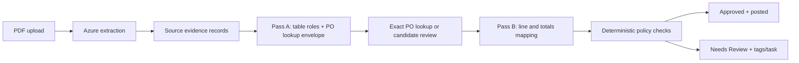

# AP Resolution Agent — Phase-Wise Implementation Plan

## Summary

Build a live Streamlit application that accepts **PDF invoices only**, extracts and interprets their tables, matches them against a seeded procurement sandbox, and produces one of two decisions:

```text
Approved     → invoice is posted to the local AP ledger
Needs Review → posting is blocked; issue tags and evidence explain why
```

There is no `Rejected` decision and no separate “unsupported document” outcome. Any PDF that cannot be mapped or validated safely becomes `Needs Review`.

The implementation creates `BUILD_SPEC.md` as the canonical product/build document and delivers a public Streamlit Community Cloud link, a resettable synthetic sandbox, and five rehearsed PDF scenarios.

## Product and Technical Contract

### Supported workflow and assumptions

- Input is an invoice PDF: machine-readable or scanned.
- Each invoice has one v# AP Resolution Agent — Phase-Wise Implementation Plan

## Summary

Build a live Streamlit application that accepts **PDF invoices only**, extracts and interprets their tables, matches them against a seeded procurement sandbox, and produces one of two decisions:

```text
Approved     → invoice is posted to the local AP ledger
Needs Review → posting is blocked; issue tags and evidence explain why
```

There is no `Rejected` decision and no separate “unsupported document” outcome. Any PDF that cannot be mapped or validated safely becomes `Needs Review`.

The implementation creates `BUILD_SPEC.md` as the canonical product/build document and delivers a public Streamlit Community Cloud link, a resettable synthetic sandbox, and five rehearsed PDF scenarios.

## Product and Technical Contract

### Supported workflow and assumptions

- Input is an invoice PDF: machine-readable or scanned.
- Each invoice has one vendor and one PO. A missing PO may be proposed for human confirmation; multiple PO references become `Needs Review`.
- A standard invoice may contain:
  - header/metadata table;
  - one or more continuation line-item tables;
  - charges/totals table;
  - irrelevant remittance or prior-balance sections.
- The supported financial context is one seeded USD entity.
- A line must map unambiguously to one PO line. Bundled or ambiguous lines become `Needs Review`.
- Tax must reconcile arithmetically; it is not consumed from the PO balance. Freight consumes PO value only when there is a seeded freight PO line.
- A small variance may auto-post only when all other controls pass:
  - maximum 1% per line price;
  - maximum $5 aggregate PO-controlled variance.

### Core processing flow



### Table-role interpretation: a core feature

Azure supplies fields, pages, tables, cells, and source locations. Before any matching, convert all usable Azure output into immutable source evidence:

```text
SourceRef
- source ID: field.invoice_total or p1.t2.r3.c4
- page, table, row, column when applicable
- raw text
- Azure confidence when available
- source span / bounding metadata
```

The LLM returns a constrained structural map using source IDs only:

```text
TableSection
- table ID and row range
- role:
  header_metadata
  line_items
  charges_and_totals
  remittance_payment
  prior_balance
  unknown
- header row, payable rows, excluded subtotal/total rows
- relevant source IDs for fields/columns
- mapping confidence and warnings
```

A table may contain multiple sections; for example, a line-items table may end in subtotal and total rows. Python validates every LLM-provided reference against Azure evidence, then reads/parses the actual cited cell. The LLM can never invent or replace a numeric value.

### Two-pass mapping and matching

**Pass A — PO lookup envelope**

Map only:

```text
vendor_name
invoice_number
invoice_date
po_reference
currency
invoice_total
optional line signatures: SKU/description, quantity, amount
```

Lookup rules:

1. Normalize an explicit PO reference and query it exactly.
2. Confirm the PO is open, USD, and belongs to the resolved approved vendor.
3. If no PO is present, filter that vendor’s open USD POs by amount, receipt availability, and line signatures.
4. Give at most five candidates to the LLM for ranking and explanation.
5. Never auto-select a candidate PO. Create `Needs Review` with `MISSING_PO` or `AMBIGUOUS_PO`; a human can confirm one candidate.

**Pass B — line and totals validation**

After an exact or human-confirmed PO is known, map:

```text
description
optional SKU/part number
quantity
UOM
unit price
line amount
freight
tax
invoice total
```

Match each payable invoice line in this order:

1. Exact normalized SKU/part number plus compatible UOM.
2. Exact normalized description plus compatible UOM.
3. Exactly one remaining PO line with compatible quantity/UOM and in-tolerance price.
4. Otherwise, `Needs Review` with `LINE_MATCH_AMBIGUOUS`.

The policy also verifies:

```text
sum(line net) + freight + tax = invoice total
invoice quantity <= received quantity - prior posted allocations
current + prior PO-controlled spend <= remaining PO value
```

### LLM and policy boundaries

Use the OpenAI Responses API with `gpt-5.4-mini` for structured table interpretation, candidate ranking, vendor alias resolution, and concise reviewer summaries. It supports function calling and structured outputs. [OpenAI model documentation](https://developers.openai.com/api/docs/models/gpt-5.4-mini)

The LLM may use only read-only evidence and candidate-lookup tools. It may not approve, change data, relax a control, calculate money, or post an invoice.

Deterministic Python owns:

```text
numeric parsing
source-reference validation
vendor/PO/receipt/history lookup
line matching
duplicate checks
tolerance calculations
decision and posting authority
```

### Data and internal interfaces

There is no public HTTP API. The application exposes these internal operations:

```text
run_invoice(pdf_upload) -> run_id
evaluate_policy(run_id) -> evaluation
resume_review(task_id, action) -> run_id
post_invoice(run_id) -> ledger_entry_id
reset_demo_data() -> seed_state
```

Persist in SQLite:

```text
vendors and aliases
PO headers and PO lines
receipt headers and receipt lines
invoice runs and normalized invoice lines
source evidence and table interpretations
posted invoices and invoice-to-PO-line allocations
review tasks
append-only run events
```

Use a seeded baseline database and a separate runtime database. `Reset demo data` replaces runtime state with the immutable seed.

`post_invoice` runs in one SQLite transaction:

1. Re-read duplicate and remaining-capacity state.
2. Insert posted invoice and line allocations.
3. Append the posting event.
4. Commit all changes together, or roll back everything.

A unique canonical vendor + normalized invoice-number constraint prevents double posting.

### Decision, execution, and issue tags

```text
Decision:
- Approved
- Needs Review

Execution:
- Posted to AP ledger
- Posting blocked
- Awaiting human confirmation
```

Blocking tags include:

```text
LOW_CONFIDENCE_EXTRACTION
EXTRACTION_FAILED
MAPPING_UNAVAILABLE
COMPLEX_LAYOUT
MISSING_REQUIRED_FIELD
CONFLICTING_FIELDS
VENDOR_UNRESOLVED
VENDOR_NOT_APPROVED
MISSING_INVOICE_NUMBER
MISSING_PO
AMBIGUOUS_PO
PO_NOT_OPEN
PO_VENDOR_MISMATCH
CURRENCY_MISMATCH
LINE_MATCH_AMBIGUOUS
MISSING_RECEIPT
QUANTITY_EXCEEDS_RECEIPT
PRICE_VARIANCE_EXCEEDED
PO_BALANCE_EXCEEDED
TOTAL_RECONCILIATION_FAILURE
POSSIBLE_DUPLICATE
CONFIRMED_DUPLICATE
MULTIPLE_PO_REFERENCES
```

Informational tags include:

```text
PARTIAL_PO_CONSUMPTION
PRICE_VARIANCE_WITHIN_TOLERANCE
```

An exact duplicate becomes:

```text
Decision: Needs Review
Tag: CONFIRMED_DUPLICATE
Execution: Posting blocked
```

Only the missing/ambiguous-PO task is interactive in this release:

```text
Confirm candidate PO → re-run Pass B and every policy check → post only if clear
Leave in review      → retain the task and block posting
```

## Phase-Wise Implementation

### Phase 0 — Freeze scope, build specification, and fixtures

**Goal:** make the demo contract testable before application work begins.

- Create `BUILD_SPEC.md` from this plan.
- Create a case manifest containing, for each fixture:
  - PDF filename and SHA-256;
  - seed profile;
  - expected decision, tags, event sequence, and database changes;
  - expected candidate PO where applicable.
- Generate five synthetic PDF fixtures:

| Fixture | PDF shape | Expected outcome |
|---|---|---|
| `happy_three_tables.pdf` | Header table, goods-line table, charges/totals table; explicit PO; matching receipt | `Approved`, posted |
| `split_invoice.pdf` | Explicit PO with prior posted allocation; remaining quantity/value sufficient | `Approved`, posted, `PARTIAL_PO_CONSUMPTION` |
| `missing_po_scan.pdf` | Scanned PDF; approved vendor alias; no PO reference; one strong PO candidate | Initially `Needs Review`; human confirms; then posted |
| `duplicate_invoice.pdf` | Same vendor and invoice number as a seeded posted invoice | `Needs Review`, `CONFIRMED_DUPLICATE`, blocked |
| `complex_layout_goods.pdf` | New multi-table PO-goods PDF with ambiguous/continuation layout | `Needs Review`, `COMPLEX_LAYOUT` or `LINE_MATCH_AMBIGUOUS`, blocked |

- Generate realistic vendor, PO, receipt, and prior-invoice seed data for exactly those fixtures.
- Use ReportLab or equivalent to create the PDFs. The scanned fixture is still a PDF, with rasterized invoice content embedded inside it.

**Exit gate:** every fixture has a known expected outcome before UI implementation starts.

### Phase 1 — Sandbox, state, and audit foundation

**Goal:** prove the process can make real, persistent demo-state changes.

- Create the SQLite schema and deterministic seed/reset mechanism.
- Implement vendor, alias, PO, PO-line, receipt, prior-invoice, allocation, event, and review-task storage.
- Implement normalized vendor, PO number, invoice number, currency, and decimal-money utilities.
- Implement `run_invoice`, `evaluate_policy`, `post_invoice`, and `resume_review` service boundaries.
- Implement transactional posting and duplicate uniqueness protection.
- Derive remaining PO/receipt capacity from allocations rather than manually editable balances.

**Exit gate:** a hand-created normalized invoice posts once, updates derived remaining capacity, appears in history, and cannot post twice.

### Phase 2 — PDF intake and Azure source evidence

**Goal:** accept real PDFs and expose trustworthy extraction evidence.

- Accept `.pdf` uploads only; reject non-PDF uploads before creating a run.
- Hash each PDF and save it as a runtime artifact for its run.
- Call Azure Document Intelligence’s prebuilt invoice model.
- Persist the complete extraction snapshot.
- Convert extracted document fields, tables, and cells into `SourceRef` records.
- Render a native PDF preview and show raw table/cell evidence in a collapsed technical section.
- For a known fixture hash only, permit a visibly labelled cached extraction fallback if Azure is unavailable.
- For arbitrary PDF extraction failure, create `Needs Review` with `EXTRACTION_FAILED`; never substitute unrelated fixture data.

**Exit gate:** all five PDFs enter the same intake path, and a user can inspect source fields/tables without trusting the LLM.

### Phase 3 — Core table interpreter and Pass A PO lookup

**Goal:** find the PO safely from variable table layouts.

- Implement structured LLM output for table sections, field source refs, and the lookup envelope.
- Validate every returned source reference before reading its value.
- Resolve vendor names against canonical names and seeded aliases.
- Query explicit PO references exactly.
- Implement missing-PO candidate prefiltering and LLM ranking.
- Create a review task rather than auto-selecting a candidate.
- Log table roles, lookup queries, candidates, evidence, and mappings as run events.

**Exit gate:** the happy PDF identifies header, line-item, and charges/totals sections; the missing-PO PDF creates a confirmable task without guessing.

### Phase 4 — Pass B mapping and deterministic policy

**Goal:** safely determine whether the known PO and invoice agree.

- Implement source-grounded line/charge mapping.
- Exclude subtotal, total, repeated header, remittance, and prior-balance rows from payable lines.
- Support continuation line tables only when their schema matches and totals aggregate cleanly.
- Implement deterministic line matching, receipt checks, split-invoice allocation checks, exact/near duplicate checks, tolerance, and arithmetic reconciliation.
- Return a structured evaluation containing checks, tags, values, source evidence, candidate PO, and final decision.
- Ensure any blocking tag prevents posting.

**Exit gate:** happy and split PDFs post exactly once; duplicate, quantity, total, mapping, and balance failures cannot post.

### Phase 5 — Review/resume workflow and bounded agent behaviour

**Goal:** demonstrate that the system advances a real exception instead of merely flagging it.

- Persist LLM proposals, candidate evidence, policy checks, human actions, and summaries in append-only events.
- Implement the missing-PO review task:
  - show the recommended candidate and evidence;
  - let the reviewer confirm it or leave it in review;
  - on confirmation, resume the original run ID;
  - rerun all policy checks before posting.
- Keep all other review tasks evidence-rich but non-overridable in this release.
- Ensure an LLM timeout or invalid structured response creates `Needs Review` with `MAPPING_UNAVAILABLE`; no unsafe fallback posting.

**Exit gate:** a live missing-PO run goes from upload → review → confirmation → revalidation → posting.

### Phase 6 — Streamlit application experience

**Goal:** make the workflow understandable to a non-technical AP buyer.

Build only three views:

1. **Dashboard**
   - approved/posted count;
   - open review tasks;
   - duplicate blocks;
   - touchless post rate;
   - chronological run history.

2. **Process Invoice**
   - PDF uploader and fixture selector using the same run function;
   - real stages as operations complete:

   ```text
   Intake → Azure extraction → Table interpretation
   → Procurement lookup → Controls → Decision/execution
   ```

   - PDF preview, detected table roles, matched PO/receipt/history evidence;
   - decision, execution state, issue tags, next action;
   - before/after PO capacity when posted.

3. **Review Queue**
   - task, tags, plain-English question, source evidence, and allowed actions;
   - candidate-PO confirmation only for missing/ambiguous PO tasks.

Do not fake stage timing or hard-code dashboard metrics.

**Exit gate:** a reviewer can understand why an invoice posted or stopped without opening raw JSON.

### Phase 7 — Tests, deployment, and rehearsal

**Goal:** make the public live demo dependable.

- Add unit tests for:
  - source-reference validation;
  - money/date/invoice/vendor/PO normalization;
  - table-role and subtotal-row exclusion;
  - line matching and UOM compatibility;
  - exact and near duplicate detection;
  - receipt and split-PO consumption;
  - tolerance boundaries;
  - transaction rollback;
  - review-task confirmation and revalidation.

- Add end-to-end tests that reset the seed, upload each actual fixture PDF, and assert:
  - decision, tags, events, task state;
  - posted invoice/allocation count;
  - remaining PO/receipt capacity# AP Resolution Agent — Phase-Wise Implementation Plan

## Summary

Build a live Streamlit application that accepts **PDF invoices only**, extracts and interprets their tables, matches them against a seeded procurement sandbox, and produces one of two decisions:

```text
Approved     → invoice is posted to the local AP ledger
Needs Review → posting is blocked; issue tags and evidence explain why
```

There is no `Rejected` decision and no separate “unsupported document” outcome. Any PDF that cannot be mapped or validated safely becomes `Needs Review`.

The implementation creates `BUILD_SPEC.md` as the canonical product/build document and delivers a public Streamlit Community Cloud link, a resettable synthetic sandbox, and five rehearsed PDF scenarios.

## Product and Technical Contract

### Supported workflow and assumptions

- Input is an invoice PDF: machine-readable or scanned.
- Each invoice has one vendor and one PO. A missing PO may be proposed for human confirmation; multiple PO references become `Needs Review`.
- A standard invoice may contain:
  - header/metadata table;
  - one or more continuation line-item tables;
  - charges/totals table;
  - irrelevant remittance or prior-balance sections.
- The supported financial context is one seeded USD entity.
- A line must map unambiguously to one PO line. Bundled or ambiguous lines become `Needs Review`.
- Tax must reconcile arithmetically; it is not consumed from the PO balance. Freight consumes PO value only when there is a seeded freight PO line.
- A small variance may auto-post only when all other controls pass:
  - maximum 1% per line price;
  - maximum $5 aggregate PO-controlled variance.

### Core processing flow


### Table-role interpretation: a core feature

Azure supplies fields, pages, tables, cells, and source locations. Before any matching, convert all usable Azure output into immutable source evidence:

```text
SourceRef
- source ID: field.invoice_total or p1.t2.r3.c4
- page, table, row, column when applicable
- raw text
- Azure confidence when available
- source span / bounding metadata
```

The LLM returns a constrained structural map using source IDs only:

```text
TableSection
- table ID and row range
- role:
  header_metadata
  line_items
  charges_and_totals
  remittance_payment
  prior_balance
  unknown
- header row, payable rows, excluded subtotal/total rows
- relevant source IDs for fields/columns
- mapping confidence and warnings
```

A table may contain multiple sections; for example, a line-items table may end in subtotal and total rows. Python validates every LLM-provided reference against Azure evidence, then reads/parses the actual cited cell. The LLM can never invent or replace a numeric value.

### Two-pass mapping and matching

**Pass A — PO lookup envelope**

Map only:

```text
vendor_name
invoice_number
invoice_date
po_reference
currency
invoice_total
optional line signatures: SKU/description, quantity, amount
```

Lookup rules:

1. Normalize an explicit PO reference and query it exactly.
2. Confirm the PO is open, USD, and belongs to the resolved approved vendor.
3. If no PO is present, filter that vendor’s open USD POs by amount, receipt availability, and line signatures.
4. Give at most five candidates to the LLM for ranking and explanation.
5. Never auto-select a candidate PO. Create `Needs Review` with `MISSING_PO` or `AMBIGUOUS_PO`; a human can confirm one candidate.

**Pass B — line and totals validation**

After an exact or human-confirmed PO is known, map:

```text
description
optional SKU/part number
quantity
UOM
unit price
line amount
freight
tax
invoice total
```

Match each payable invoice line in this order:

1. Exact normalized SKU/part number plus compatible UOM.
2. Exact normalized description plus compatible UOM.
3. Exactly one remaining PO line with compatible quantity/UOM and in-tolerance price.
4. Otherwise, `Needs Review` with `LINE_MATCH_AMBIGUOUS`.

The policy also verifies:

```text
sum(line net) + freight + tax = invoice total
invoice quantity <= received quantity - prior posted allocations
current + prior PO-controlled spend <= remaining PO value
```

### LLM and policy boundaries

Use the OpenAI Responses API with `gpt-5.4-mini` for structured table interpretation, candidate ranking, vendor alias resolution, and concise reviewer summaries. It supports function calling and structured outputs. [OpenAI model documentation](https://developers.openai.com/api/docs/models/gpt-5.4-mini)

The LLM may use only read-only evidence and candidate-lookup tools. It may not approve, change data, relax a control, calculate money, or post an invoice.

Deterministic Python owns:

```text
numeric parsing
source-reference validation
vendor/PO/receipt/history lookup
line matching
duplicate checks
tolerance calculations
decision and posting authority
```

### Data and internal interfaces

There is no public HTTP API. The application exposes these internal operations:

```text
run_invoice(pdf_upload) -> run_id
evaluate_policy(run_id) -> evaluation
resume_review(task_id, action) -> run_id
post_invoice(run_id) -> ledger_entry_id
reset_demo_data() -> seed_state
```

Persist in SQLite:

```text
vendors and aliases
PO headers and PO lines
receipt headers and receipt lines
invoice runs and normalized invoice lines
source evidence and table interpretations
posted invoices and invoice-to-PO-line allocations
review tasks
append-only run events
```

Use a seeded baseline database and a separate runtime database. `Reset demo data` replaces runtime state with the immutable seed.

`post_invoice` runs in one SQLite transaction:

1. Re-read duplicate and remaining-capacity state.
2. Insert posted invoice and line allocations.
3. Append the posting event.
4. Commit all changes together, or roll back everything.

A unique canonical vendor + normalized invoice-number constraint prevents double posting.

### Decision, execution, and issue tags

```text
Decision:
- Approved
- Needs Review

Execution:
- Posted to AP ledger
- Posting blocked
- Awaiting human confirmation
```

Blocking tags include:

```text
LOW_CONFIDENCE_EXTRACTION
EXTRACTION_FAILED
MAPPING_UNAVAILABLE
COMPLEX_LAYOUT
MISSING_REQUIRED_FIELD
CONFLICTING_FIELDS
VENDOR_UNRESOLVED
VENDOR_NOT_APPROVED
MISSING_INVOICE_NUMBER
MISSING_PO
AMBIGUOUS_PO
PO_NOT_OPEN
PO_VENDOR_MISMATCH
CURRENCY_MISMATCH
LINE_MATCH_AMBIGUOUS
MISSING_RECEIPT
QUANTITY_EXCEEDS_RECEIPT
PRICE_VARIANCE_EXCEEDED
PO_BALANCE_EXCEEDED
TOTAL_RECONCILIATION_FAILURE
POSSIBLE_DUPLICATE
CONFIRMED_DUPLICATE
MULTIPLE_PO_REFERENCES
```

Informational tags include:

```text
PARTIAL_PO_CONSUMPTION
PRICE_VARIANCE_WITHIN_TOLERANCE
```

An exact duplicate becomes:

```text
Decision: Needs Review
Tag: CONFIRMED_DUPLICATE
Execution: Posting blocked
```

Only the missing/ambiguous-PO task is interactive in this release:

```text
Confirm candidate PO → re-run Pass B and every policy check → post only if clear
Leave in review      → retain the task and block posting
```

## Phase-Wise Implementation

### Phase 0 — Freeze scope, build specification, and fixtures

**Goal:** make the demo contract testable before application work begins.

- Create `BUILD_SPEC.md` from this plan.
- Create a case manifest containing, for each fixture:
  - PDF filename and SHA-256;
  - seed profile;
  - expected decision, tags, event sequence, and database changes;
  - expected candidate PO where applicable.
- Generate five synthetic PDF fixtures:

| Fixture | PDF shape | Expected outcome |
|---|---|---|
| `happy_three_tables.pdf` | Header table, goods-line table, charges/totals table; explicit PO; matching receipt | `Approved`, posted |
| `split_invoice.pdf` | Explicit PO with prior posted allocation; remaining quantity/value sufficient | `Approved`, posted, `PARTIAL_PO_CONSUMPTION` |
| `missing_po_scan.pdf` | Scanned PDF; approved vendor alias; no PO reference; one strong PO candidate | Initially `Needs Review`; human confirms; then posted |
| `duplicate_invoice.pdf` | Same vendor and invoice number as a seeded posted invoice | `Needs Review`, `CONFIRMED_DUPLICATE`, blocked |
| `complex_layout_goods.pdf` | New multi-table PO-goods PDF with ambiguous/continuation layout | `Needs Review`, `COMPLEX_LAYOUT` or `LINE_MATCH_AMBIGUOUS`, blocked |

- Generate realistic vendor, PO, receipt, and prior-invoice seed data for exactly those fixtures.
- Use ReportLab or equivalent to create the PDFs. The scanned fixture is still a PDF, with rasterized invoice content embedded inside it.

**Exit gate:** every fixture has a known expected outcome before UI implementation starts.

### Phase 1 — Sandbox, state, and audit foundation

**Goal:** prove the process can make real, persistent demo-state changes.

- Create the SQLite schema and deterministic seed/reset mechanism.
- Implement vendor, alias, PO, PO-line, receipt, prior-invoice, allocation, event, and review-task storage.
- Implement normalized vendor, PO number, invoice number, currency, and decimal-money utilities.
- Implement `run_invoice`, `evaluate_policy`, `post_invoice`, and `resume_review` service boundaries.
- Implement transactional posting and duplicate uniqueness protection.
- Derive remaining PO/receipt capacity from allocations rather than manually editable balances.

**Exit gate:** a hand-created normalized invoice posts once, updates derived remaining capacity, appears in history, and cannot post twice.

### Phase 2 — PDF intake and Azure source evidence

**Goal:** accept real PDFs and expose trustworthy extraction evidence.

- Accept `.pdf` uploads only; reject non-PDF uploads before creating a run.
- Hash each PDF and save it as a runtime artifact for its run.
- Call Azure Document Intelligence’s prebuilt invoice model.
- Persist the complete extraction snapshot.
- Convert extracted document fields, tables, and cells into `SourceRef` records.
- Render a native PDF preview and show raw table/cell evidence in a collapsed technical section.
- For a known fixture hash only, permit a visibly labelled cached extraction fallback if Azure is unavailable.
- For arbitrary PDF extraction failure, create `Needs Review` with `EXTRACTION_FAILED`; never substitute unrelated fixture data.

**Exit gate:** all five PDFs enter the same intake path, and a user can inspect source fields/tables without trusting the LLM.

### Phase 3 — Core table interpreter and Pass A PO lookup

**Goal:** find the PO safely from variable table layouts.

- Implement structured LLM output for table sections, field source refs, and the lookup envelope.
- Validate every returned source reference before reading its value.
- Resolve vendor names against canonical names and seeded aliases.
- Query explicit PO references exactly.
- Implement missing-PO candidate prefiltering and LLM ranking.
- Create a review task rather than auto-selecting a candidate.
- Log table roles, lookup queries, candidates, evidence, and mappings as run events.

**Exit gate:** the happy PDF identifies header, line-item, and charges/totals sections; the missing-PO PDF creates a confirmable task without guessing.

### Phase 4 — Pass B mapping and deterministic policy

**Goal:** safely determine whether the known PO and invoice agree.

- Implement source-grounded line/charge mapping.
- Exclude subtotal, total, repeated header, remittance, and prior-balance rows from payable lines.
- Support continuation line tables only when their schema matches and totals aggregate cleanly.
- Implement deterministic line matching, receipt checks, split-invoice allocation checks, exact/near duplicate checks, tolerance, and arithmetic reconciliation.
- Return a structured evaluation containing checks, tags, values, source evidence, candidate PO, and final decision.
- Ensure any blocking tag prevents posting.

**Exit gate:** happy and split PDFs post exactly once; duplicate, quantity, total, mapping, and balance failures cannot post.

### Phase 5 — Review/resume workflow and bounded agent behaviour

**Goal:** demonstrate that the system advances a real exception instead of merely flagging it.

- Persist LLM proposals, candidate evidence, policy checks, human actions, and summaries in append-only events.
- Implement the missing-PO review task:
  - show the recommended candidate and evidence;
  - let the reviewer confirm it or leave it in review;
  - on confirmation, resume the original run ID;
  - rerun all policy checks before posting.
- Keep all other review tasks evidence-rich but non-overridable in this release.
- Ensure an LLM timeout or invalid structured response creates `Needs Review` with `MAPPING_UNAVAILABLE`; no unsafe fallback posting.

**Exit gate:** a live missing-PO run goes from upload → review → confirmation → revalidation → posting.

### Phase 6 — Streamlit application experience

**Goal:** make the workflow understandable to a non-technical AP buyer.

Build only three views:

1. **Dashboard**
   - approved/posted count;
   - open review tasks;
   - duplicate blocks;
   - touchless post rate;
   - chronological run history.

2. **Process Invoice**
   - PDF uploader and fixture selector using the same run function;
   - real stages as operations complete:

   ```text
   Intake → Azure extraction → Table interpretation
   → Procurement lookup → Controls → Decision/execution
   ```

   - PDF preview, detected table roles, matched PO/receipt/history evidence;
   - decision, execution state, issue tags, next action;
   - before/after PO capacity when posted.

3. **Review Queue**
   - task, tags, plain-English question, source evidence, and allowed actions;
   - candidate-PO confirmation only for missing/ambiguous PO tasks.

Do not fake stage timing or hard-code dashboard metrics.

**Exit gate:** a reviewer can understand why an invoice posted or stopped without opening raw JSON.

### Phase 7 — Tests, deployment, and rehearsal

**Goal:** make the public live demo dependable.

- Add unit tests for:
  - source-reference validation;
  - money/date/invoice/vendor/PO normalization;
  - table-role and subtotal-row exclusion;
  - line matching and UOM compatibility;
  - exact and near duplicate detection;
  - receipt and split-PO consumption;
  - tolerance boundaries;
  - transaction rollback;
  - review-task confirmation and revalidation.

- Add end-to-end tests that reset the seed, upload each actual fixture PDF, and assert:
  - decision, tags, events, task state;
  - posted invoice/allocation count;
  - remaining PO/receipt capacity;
  - dashboard history update.

- Deploy to Streamlit Community Cloud:
  - use Python 3.12 locally and in deployment for parity; Community Cloud defaults to Python 3.12 and lets the deployer select Python/secrets in Advanced settings. [Streamlit deployment documentation](https://docs.streamlit.io/deploy/streamlit-community-cloud/deploy-your-app/deploy)
  - use a root `requirements.txt`;
  - configure only:

    ```text
    AZURE_DOCUMENT_INTELLIGENCE_ENDPOINT
    AZURE_DOCUMENT_INTELLIGENCE_KEY
    OPENAI_API_KEY
    OPENAI_MODEL=gpt-5.4-mini
    ```

  - keep secrets out of Git and out of UI/log output.
  - treat SQLite as resettable demo state; on app start/restart, recreate runtime state from the seed.

- Smoke-test the deployed public link in a private browser:
  - run the happy PDF;
  - confirm live stages, posting, capacity update, and dashboard history;
  - reset data;
  - run the missing-PO review/resume flow;
  - verify no secrets or unexpected raw document content appear.

**Exit gate:** the public link reliably supports reset → happy path → review path → dashboard verification.

## Demo and Acceptance Plan

### Five-minute recording sequence

```text
0:00–0:25  Dashboard: explain narrow scope and two decisions.
0:25–1:55  Upload happy_three_tables.pdf:
            show three table roles, PO/receipt checks, post, balance update.
1:55–3:35  Upload missing_po_scan.pdf:
            show candidate evidence, confirm PO, revalidate, post.
3:35–4:20  Show duplicate_invoice.pdf:
            evidence, CONFIRMED_DUPLICATE, no ledger mutation.
4:20–5:00  Show complex_layout_goods.pdf:
            table-role evidence, Needs Review tag, dashboard history.
```

### Final acceptance criteria

- A public live link accepts real PDFs and runs the process end-to-end.
- The happy path posts exactly once and changes sandbox state.
- At least four deliberate edge cases behave according to the manifest.
- Table roles, source evidence, controls, tags, and decisions are visible.
- Every non-approved result is `Needs Review` with a specific next action or issue tag.
- The missing-PO review loop resumes the same run and revalidates before posting.
- Reset makes every demo fixture reproducible.
- The demo video is under five minutes, has no slides, and shows a live happy path plus live edge case.
;
  - dashboard history update.

- Deploy to Streamlit Community Cloud:
  - use Python 3.12 locally and in deployment for parity; Community Cloud defaults to Python 3.12 and lets the deployer select Python/secrets in Advanced settings. [Streamlit deployment documentation](https://docs.streamlit.io/deploy/streamlit-community-cloud/deploy-your-app/deploy)
  - use a root `requirements.txt`;
  - configure only:

    ```text
    AZURE_DOCUMENT_INTELLIGENCE_ENDPOINT
    AZURE_DOCUMENT_INTELLIGENCE_KEY
    OPENAI_API_KEY
    OPENAI_MODEL=gpt-5.4-mini
    ```

  - keep secrets out of Git and out of UI/log output.
  - treat SQLite as resettable demo state; on app start/restart, recreate runtime state from the seed.

- Smoke-test the deployed public link in a private browser:
  - run the happy PDF;
  - confirm live stages, posting, capacity update, and dashboard history;
  - reset data;
  - run the missing-PO review/resume flow;
  - verify no secrets or unexpected raw document content appear.

**Exit gate:** the public link reliably supports reset → happy path → review path → dashboard verification.

## Demo and Acceptance Plan

### Five-minute recording sequence

```text
0:00–0:25  Dashboard: explain narrow scope and two decisions.
0:25–1:55  Upload happy_three_tables.pdf:
            show three table roles, PO/receipt checks, post, balance update.
1:55–3:35  Upload missing_po_scan.pdf:
            show candidate evidence, confirm PO, revalidate, post.
3:35–4:20  Show duplicate_invoice.pdf:
            evidence, CONFIRMED_DUPLICATE, no ledger mutation.
4:20–5:00  Show complex_layout_goods.pdf:
            table-role evidence, Needs Review tag, dashboard history.
```

### Final acceptance criteria

- A public live link accepts real PDFs and runs the process end-to-end.
- The happy path posts exactly once and changes sandbox state.
- At least four deliberate edge cases behave according to the manifest.
- Table roles, source evidence, controls, tags, and decisions are visible.
- Every non-approved result is `Needs Review` with a specific next action or issue tag.
- The missing-PO review loop resumes the same run and revalidates before posting.
- Reset makes every demo fixture reproducible.
- The demo video is under five minutes, has no slides, and shows a live happy path plus live edge case.
endor and one PO. A missing PO may be proposed for human confirmation; multiple PO references become `Needs Review`.
- A standard invoice may contain:
  - header/metadata table;
  - one or more continuation line-item tables;
  - charges/totals table;
  - irrelevant remittance or prior-balance sections.
- The supported financial context is one seeded USD entity.
- A line must map unambiguously to one PO line. Bundled or ambiguous lines become `Needs Review`.
- Tax must reconcile arithmetically; it is not consumed from the PO balance. Freight consumes PO value only when there is a seeded freight PO line.
- A small variance may auto-post only when all other controls pass:
  - maximum 1% per line price;
  - maximum $5 aggregate PO-controlled variance.

### Core processing flow


### Table-role interpretation: a core feature

Azure supplies fields, pages, tables, cells, and source locations. Before any matching, convert all usable Azure output into immutable source evidence:

```text
SourceRef
- source ID: field.invoice_total or p1.t2.r3.c4
- page, table, row, column when applicable
- raw text
- Azure confidence when available
- source span / bounding metadata
```

The LLM returns a constrained structural map using source IDs only:

```text
TableSection
- table ID and row range
- role:
  header_metadata
  line_items
  charges_and_totals
  remittance_payment
  prior_balance
  unknown
- header row, payable rows, excluded subtotal/total rows
- relevant source IDs for fields/columns
- mapping confidence and warnings
```

A table may contain multiple sections; for example, a line-items table may end in subtotal and total rows. Python validates every LLM-provided reference against Azure evidence, then reads/parses the actual cited cell. The LLM can never invent or replace a numeric value.

### Two-pass mapping and matching

**Pass A — PO lookup envelope**

Map only:

```text
vendor_name
invoice_number
invoice_date
po_reference
currency
invoice_total
optional line signatures: SKU/description, quantity, amount
```

Lookup rules:

1. Normalize an explicit PO reference and query it exactly.
2. Confirm the PO is open, USD, and belongs to the resolved approved vendor.
3. If no PO is present, filter that vendor’s open USD POs by amount, receipt availability, and line signatures.
4. Give at most five candidates to the LLM for ranking and explanation.
5. Never auto-select a candidate PO. Create `Needs Review` with `MISSING_PO` or `AMBIGUOUS_PO`; a human can confirm one candidate.

**Pass B — line and totals validation**

After an exact or human-confirmed PO is known, map:

```text
description
optional SKU/part number
quantity
UOM
unit price
line amount
freight
tax
invoice total
```

Match each payable invoice line in this order:

1. Exact normalized SKU/part number plus compatible UOM.
2. Exact normalized description plus compatible UOM.
3. Exactly one remaining PO line with compatible quantity/UOM and in-tolerance price.
4. Otherwise, `Needs Review` with `LINE_MATCH_AMBIGUOUS`.

The policy also verifies:

```text
sum(line net) + freight + tax = invoice total
invoice quantity <= received quantity - prior posted allocations
current + prior PO-controlled spend <= remaining PO value
```

### LLM and policy boundaries

Use the OpenAI Responses API with `gpt-5.4-mini` for structured table interpretation, candidate ranking, vendor alias resolution, and concise reviewer summaries. It supports function calling and structured outputs. [OpenAI model documentation](https://developers.openai.com/api/docs/models/gpt-5.4-mini)

The LLM may use only read-only evidence and candidate-lookup tools. It may not approve, change data, relax a control, calculate money, or post an invoice.

Deterministic Python owns:

```text
numeric parsing
source-reference validation
vendor/PO/receipt/history lookup
line matching
duplicate checks
tolerance calculations
decision and posting authority
```

### Data and internal interfaces

There is no public HTTP API. The application exposes these internal operations:

```text
run_invoice(pdf_upload) -> run_id
evaluate_policy(run_id) -> evaluation
resume_review(task_id, action) -> run_id
post_invoice(run_id) -> ledger_entry_id
reset_demo_data() -> seed_state
```

Persist in SQLite:

```text
vendors and aliases
PO headers and PO lines
receipt headers and receipt lines
invoice runs and normalized invoice lines
source evidence and table interpretations
posted invoices and invoice-to-PO-line allocations
review tasks
append-only run events
```

Use a seeded baseline database and a separate runtime database. `Reset demo data` replaces runtime state with the immutable seed.

`post_invoice` runs in one SQLite transaction:

1. Re-read duplicate and remaining-capacity state.
2. Insert posted invoice and line allocations.
3. Append the posting event.
4. Commit all changes together, or roll back everything.

A unique canonical vendor + normalized invoice-number constraint prevents double posting.

### Decision, execution, and issue tags

```text
Decision:
- Approved
- Needs Review

Execution:
- Posted to AP ledger
- Posting blocked
- Awaiting human confirmation
```

Blocking tags include:

```text
LOW_CONFIDENCE_EXTRACTION
EXTRACTION_FAILED
MAPPING_UNAVAILABLE
COMPLEX_LAYOUT
MISSING_REQUIRED_FIELD
CONFLICTING_FIELDS
VENDOR_UNRESOLVED
VENDOR_NOT_APPROVED
MISSING_INVOICE_NUMBER
MISSING_PO
AMBIGUOUS_PO
PO_NOT_OPEN
PO_VENDOR_MISMATCH
CURRENCY_MISMATCH
LINE_MATCH_AMBIGUOUS
MISSING_RECEIPT
QUANTITY_EXCEEDS_RECEIPT
PRICE_VARIANCE_EXCEEDED
PO_BALANCE_EXCEEDED
TOTAL_RECONCILIATION_FAILURE
POSSIBLE_DUPLICATE
CONFIRMED_DUPLICATE
MULTIPLE_PO_REFERENCES
```

Informational tags include:

```text
PARTIAL_PO_CONSUMPTION
PRICE_VARIANCE_WITHIN_TOLERANCE
```

An exact duplicate becomes:

```text
Decision: Needs Review
Tag: CONFIRMED_DUPLICATE
Execution: Posting blocked
```

Only the missing/ambiguous-PO task is interactive in this release:

```text
Confirm candidate PO → re-run Pass B and every policy check → post only if clear
Leave in review      → retain the task and block posting
```

## Phase-Wise Implementation

### Phase 0 — Freeze scope, build specification, and fixtures

**Goal:** make the demo contract testable before application work begins.

- Create `BUILD_SPEC.md` from this plan.
- Create a case manifest containing, for each fixture:
  - PDF filename and SHA-256;
  - seed profile;
  - expected decision, tags, event sequence, and database changes;
  - expected candidate PO where applicable.
- Generate five synthetic PDF fixtures:

| Fixture | PDF shape | Expected outcome |
|---|---|---|
| `happy_three_tables.pdf` | Header table, goods-line table, charges/totals table; explicit PO; matching receipt | `Approved`, posted |
| `split_invoice.pdf` | Explicit PO with prior posted allocation; remaining quantity/value sufficient | `Approved`, posted, `PARTIAL_PO_CONSUMPTION` |
| `missing_po_scan.pdf` | Scanned PDF; approved vendor alias; no PO reference; one strong PO candidate | Initially `Needs Review`; human confirms; then posted |
| `duplicate_invoice.pdf` | Same vendor and invoice number as a seeded posted invoice | `Needs Review`, `CONFIRMED_DUPLICATE`, blocked |
| `complex_layout_goods.pdf` | New multi-table PO-goods PDF with ambiguous/continuation layout | `Needs Review`, `COMPLEX_LAYOUT` or `LINE_MATCH_AMBIGUOUS`, blocked |

- Generate realistic vendor, PO, receipt, and prior-invoice seed data for exactly those fixtures.
- Use ReportLab or equivalent to create the PDFs. The scanned fixture is still a PDF, with rasterized invoice content embedded inside it.

**Exit gate:** every fixture has a known expected outcome before UI implementation starts.

### Phase 1 — Sandbox, state, and audit foundation

**Goal:** prove the process can make real, persistent demo-state changes.

- Create the SQLite schema and deterministic seed/reset mechanism.
- Implement vendor, alias, PO, PO-line, receipt, prior-invoice, allocation, event, and review-task storage.
- Implement normalized vendor, PO number, invoice number, currency, and decimal-money utilities.
- Implement `run_invoice`, `evaluate_policy`, `post_invoice`, and `resume_review` service boundaries.
- Implement transactional posting and duplicate uniqueness protection.
- Derive remaining PO/receipt capacity from allocations rather than manually editable balances.

**Exit gate:** a hand-created normalized invoice posts once, updates derived remaining capacity, appears in history, and cannot post twice.

### Phase 2 — PDF intake and Azure source evidence

**Goal:** accept real PDFs and expose trustworthy extraction evidence.

- Accept `.pdf` uploads only; reject non-PDF uploads before creating a run.
- Hash each PDF and save it as a runtime artifact for its run.
- Call Azure Document Intelligence’s prebuilt invoice model.
- Persist the complete extraction snapshot.
- Convert extracted document fields, tables, and cells into `SourceRef` records.
- Render a native PDF preview and show raw table/cell evidence in a collapsed technical section.
- For a known fixture hash only, permit a visibly labelled cached extraction fallback if Azure is unavailable.
- For arbitrary PDF extraction failure, create `Needs Review` with `EXTRACTION_FAILED`; never substitute unrelated fixture data.

**Exit gate:** all five PDFs enter the same intake path, and a user can inspect source fields/tables without trusting the LLM.

### Phase 3 — Core table interpreter and Pass A PO lookup

**Goal:** find the PO safely from variable table layouts.

- Implement structured LLM output for table sections, field source refs, and the lookup envelope.
- Validate every returned source reference before reading its value.
- Resolve vendor names against canonical names and seeded aliases.
- Query explicit PO references exactly.
- Implement missing-PO candidate prefiltering and LLM ranking.
- Create a review task rather than auto-selecting a candidate.
- Log table roles, lookup queries, candidates, evidence, and mappings as run events.

**Exit gate:** the happy PDF identifies header, line-item, and charges/totals sections; the missing-PO PDF creates a confirmable task without guessing.

### Phase 4 — Pass B mapping and deterministic policy

**Goal:** safely determine whether the known PO and invoice agree.

- Implement source-grounded line/charge mapping.
- Exclude subtotal, total, repeated header, remittance, and prior-balance rows from payable lines.
- Support continuation line tables only when their schema matches and totals aggregate cleanly.
- Implement deterministic line matching, receipt checks, split-invoice allocation checks, exact/near duplicate checks, tolerance, and arithmetic reconciliation.
- Return a structured evaluation containing checks, tags, values, source evidence, candidate PO, and final decision.
- Ensure any blocking tag prevents posting.

**Exit gate:** happy and split PDFs post exactly once; duplicate, quantity, total, mapping, and balance failures cannot post.

### Phase 5 — Review/resume workflow and bounded agent behaviour

**Goal:** demonstrate that the system advances a real exception instead of merely flagging it.

- Persist LLM proposals, candidate evidence, policy checks, human actions, and summaries in append-only events.
- Implement the missing-PO review task:
  - show the recommended candidate and evidence;
  - let the reviewer confirm it or leave it in review;
  - on confirmation, resume the original run ID;
  - rerun all policy checks before posting.
- Keep all other review tasks evidence-rich but non-overridable in this release.
- Ensure an LLM timeout or invalid structured response creates `Needs Review` with `MAPPING_UNAVAILABLE`; no unsafe fallback posting.

**Exit gate:** a live missing-PO run goes from upload → review → confirmation → revalidation → posting.

### Phase 6 — Streamlit application experience

**Goal:** make the workflow understandable to a non-technical AP buyer.

Build only three views:

1. **Dashboard**
   - approved/posted count;
   - open review tasks;
   - duplicate blocks;
   - touchless post rate;
   - chronological run history.

2. **Process Invoice**
   - PDF uploader and fixture selector using the same run function;
   - real stages as operations complete:

   ```text
   Intake → Azure extraction → Table interpretation
   → Procurement lookup → Controls → Decision/execution
   ```

   - PDF preview, detected table roles, matched PO/receipt/history evidence;
   - decision, execution state, issue tags, next action;
   - before/after PO capacity when posted.

3. **Review Queue**
   - task, tags, plain-English question, source evidence, and allowed actions;
   - candidate-PO confirmation only for missing/ambiguous PO tasks.

Do not fake stage timing or hard-code dashboard metrics.

**Exit gate:** a reviewer can understand why an invoice posted or stopped without opening raw JSON.

### Phase 7 — Tests, deployment, and rehearsal

**Goal:** make the public live demo dependable.

- Add unit tests for:
  - source-reference validation;
  - money/date/invoice/vendor/PO normalization;
  - table-role and subtotal-row exclusion;
  - line matching and UOM compatibility;
  - exact and near duplicate detection;
  - receipt and split-PO consumption;
  - tolerance boundaries;
  - transaction rollback;
  - review-task confirmation and revalidation.

- Add end-to-end tests that reset the seed, upload each actual fixture PDF, and assert:
  - decision, tags, events, task state;
  - posted invoice/allocation count;
  - remaining PO/receipt capacity;
  - dashboard history update.

- Deploy to Streamlit Community Cloud:
  - use Python 3.12 locally and in deployment for parity; Community Cloud defaults to Python 3.12 and lets the deployer select Python/secrets in Advanced settings. [Streamlit deployment documentation](https://docs.streamlit.io/deploy/streamlit-community-cloud/deploy-your-app/deploy)
  - use a root `requirements.txt`;
  - configure only:

    ```text
    AZURE_DOCUMENT_INTELLIGENCE_ENDPOINT
    AZURE_DOCUMENT_INTELLIGENCE_KEY
    OPENAI_API_KEY
    OPENAI_MODEL=gpt-5.4-mini
    ```

  - keep secrets out of Git and out of UI/log output.
  - treat SQLite as resettable demo state; on app start/restart, recreate runtime state from the seed.

- Smoke-test the deployed public link in a private browser:
  - run the happy PDF;
  - confirm live stages, posting, capacity update, and dashboard history;
  - reset data;
  - run the missing-PO review/resume flow;
  - verify no secrets or unexpected raw document content appear.

**Exit gate:** the public link reliably supports reset → happy path → review path → dashboard verification.

## Demo and Acceptance Plan

### Five-minute recording sequence

```text
0:00–0:25  Dashboard: explain narrow scope and two decisions.
0:25–1:55  Upload happy_three_tables.pdf:
            show three table roles, PO/receipt checks, post, balance update.
1:55–3:35  Upload missing_po_scan.pdf:
            show candidate evidence, confirm PO, revalidate, post.
3:35–4:20  Show duplicate_invoice.pdf:
            evidence, CONFIRMED_DUPLICATE, no ledger mutation.
4:20–5:00  Show complex_layout_goods.pdf:
            table-role evidence, Needs Review tag, dashboard history.
```

### Final acceptance criteria

- A public live link accepts real PDFs and runs the process end-to-end.
- The happy path posts exactly once and changes sandbox state.
- At least four deliberate edge cases behave according to the manifest.
- Table roles, source evidence, controls, tags, and decisions are visible.
- Every non-approved result is `Needs Review` with a specific next action or issue tag.
- The missing-PO review loop resumes the same run and revalidates before posting.
- Reset makes every demo fixture reproducible.
- The demo video is under five minutes, has no slides, and shows a live happy path plus live edge case.
